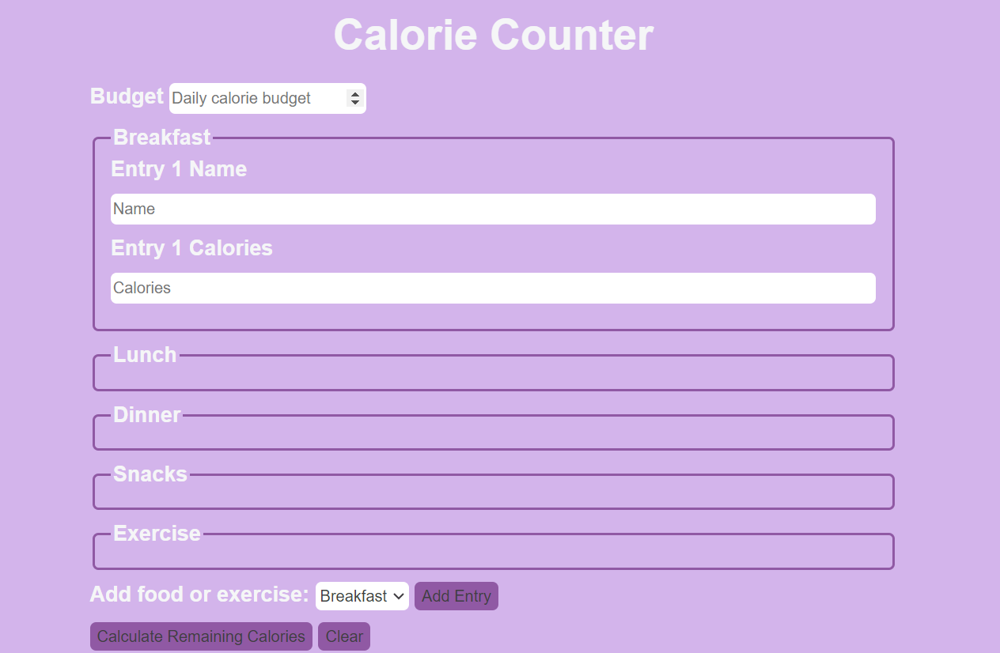

# Calorie Counter

This repository contains a simple web application for tracking daily calorie intake and expenditure. Users can input their meals and exercises to calculate their remaining calorie budget for the day.





## Used

- HTML Structure
- JavaScript Code
- CSS
## Features

- Add Entry: Users can add entries for meals (breakfast, lunch, dinner, snacks) and exercises. The form dynamically generates input fields for each entry.

- Calculate Calories: The application calculates the remaining calorie budget based on the user's input for consumed calories, exercise calories burned, and the budgeted calories.

- Error Handling: The application checks for invalid inputs, such as scientific notation, and alerts the user. An error flag is used to prevent further calculations in case of an error.

- Clear Form: Users can clear all entries and reset the form with a single button click.


## Run Locally

Clone the project

```bash
  git clone https://github.com/Meybe-1in/Calorie-Counter.git
```

Go to the project directory

```bash
  cd Calorie-Counter
```

Open in Browser

Open the index.html file in a web browser.
Enter the budgeted calories for the day.
Add entries for meals and exercises using the dropdown menu and the "Add Entry" button.
Click the "Calculate" button to see the remaining calorie budget and other details.
To start fresh, click the "Clear" button.

This web application does not have external dependencies. It uses plain HTML, CSS, and vanilla JavaScript for its functionality.
